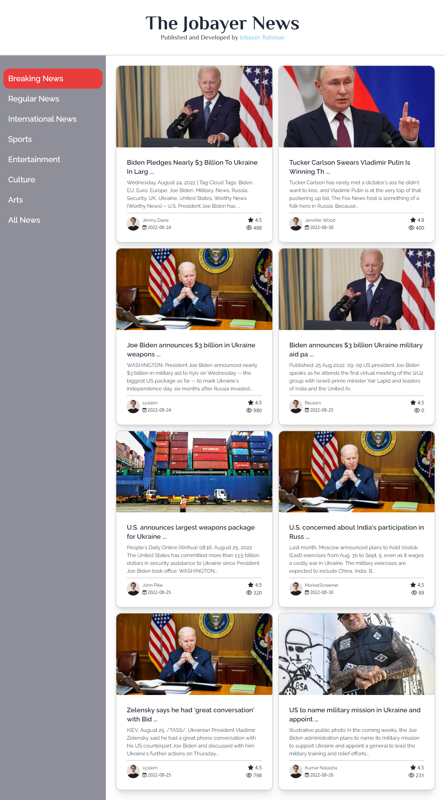
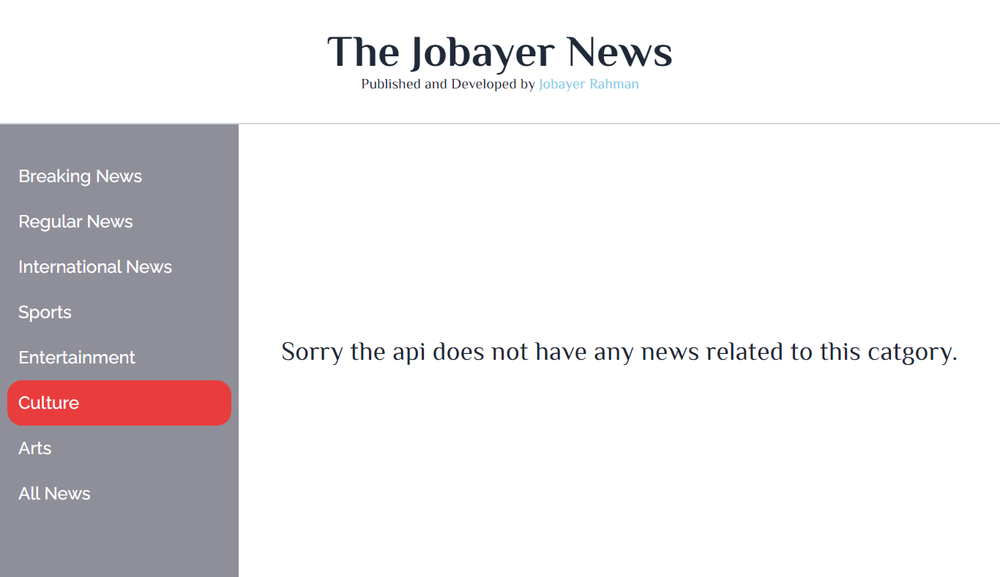

# This is a news poetal I will be adding all the necessary info's here:
## I Dont knwo what I am donig, Just goofing around

there are 3 api links i will be using here. I will try my best to add all the details related to the website. like font family, color codes etc.

# 1st one is for the categorys:

  https://openapi.programming-hero.com/api/news/categories

# 2nd one is for the category news headlines (basically): 

  https://openapi.programming-hero.com/api/news/category/01

# 3d one is for the datailed news:

  https://openapi.programming-hero.com/api/news/0282e0e58a5c404fbd15261f11c2ab6a

for fonts i am willing to use 2 type of fonts 1 for the title of the website. and otherone for the everthing else.

font for heading is:

# Philosopher

font for entire website is:

# Raleway

